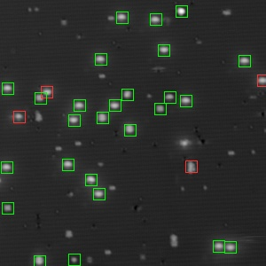
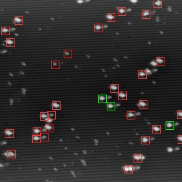

# STM Tip Detector

A machine learning solution for automatically assessing the sharpness of Scanning Tunneling Microscope (STM) tips using convolutional neural networks.

## Table of Contents

-   [Overview](#overview)
-   [Getting Started](#getting-started)
    -   [Installation](#installation)
    -   [Usage](#usage)
-   [Program Overview](#program-overview)
-   [Configurations](#configurations)
-   [Model Training](#model-training)
-   [API Input and Output](#api-input-and-output)
-   [Additional Information](#additional-information)
-   [License](#license)

## Overview

This project utilizes a convolutional neural network to analyze STM images and predict tip sharpness based on the extraction of dangling bond features. By automating this critical assessment, the STM Tip Detector aims to enhance the efficiency and reliability of STM operations.

STM is a powerful tool used to image surfaces at the atomic level, where tip sharpness is crucial for obtaining high-quality images. Sharp tips are essential for precise measurements and are particularly important for vision-related lithography automations. This software package provides a comprehensive solution for processing STM images, extracting relevant features, training machine learning models, and making real-time predictions on tip quality.

### Examples

Scanned STM images with sharp and dull tips processed by [detector.py](detector.py) are shown below:

 

## Getting Started

### Installation

1. Clone the repository:

```bash
git clone https://github.com/Superamaja/stm-tip-detector
```

2. Install the required packages:

```bash
pip install -r requirements.txt
```

### Usage

Run any python file in the root directory to start a program:

```bash
python <program>.py
```

Please see the [Program Overview](#program-overview) section for more information on the programs that can be run. Along with [Model Training](#model-training) for more information on training a model.

### API Usage

The programs that can be run are listed below in the [Program Overview](#program-overview) section.

For sole usage of the API, copy the following files to your project:

-   [detector_functions/](detector_functions/)
-   [api.py](api.py)
-   [config.json](config.json)
-   [model.h5](model.h5) - **NOT PROVIDED HERE**

Then start the API:

```bash
python api.py
```

See the [API Input and Output](#api-input-and-output) section for more information on the API.

## Program Overview

**api.py** - The API that allows for external interfaces to interact with the software to make predictions. Real examples for the JSON input and outputs are in the [/api_examples](api_examples) folder. The full list of parameters can be found at the [API Input and Output](#api-input-and-output) section. The API serves to `localhost:5050` by default.

The following flags can be used to run the API:

-   `--host <host>` - The host to run the API on. Default is `localhost`.
-   `--port <port>` - The port to run the API on. Default is `5050`.

---

**detector.py** - An interface for the software to make predictions on STM images. Allows for efficient scanning of STM images to test models, along with useful debugging windows. Saves the configurations of the STM images (contrast, rotation, etc) to speed up the process of testing models. Exports a `results.csv` file that contains information about the output.

The following flags can be used to run the detector:

-   `-sd` - Activates the scan debug mode, which will display the scanned STM image along with other useful windows and information.
-   `-rd` - Activates the ROI debug mode, which will display each extracted ROI from the STM image. Useful for visually debugging the ROI that gets passed to the model.

---

**processor.py** - A program designed to process STM images and extract the dangling bond features from them to ensure consistency in the data along with matching the detector's extraction process for predictions.

The following flags can be used to run the processor:

-   `-d` - Activates the debug mode, which will display each training image along with the extraction of each ROI. Useful for visually debugging the ROI that becomes the new training data.

-   `-s <start_index>` - Start index for which image to start processing. Useful for debugging at a certain point in the dataset.

-   `-i <image_directory>` - The image directory to process. Overrides the default image directory in a variable at the top of the file.

---

**trainer.py** - A program designed to train a machine learning model on the extracted features from the STM images. Comes with detailed logging for efficient model fine-tuning.

## Configurations

**config.json** - A configuration file that contains all the hyperparameters for the model. Used for global variables that need to be consistent across all components of the software. Also includes variables to speed up the process of creating and testing models.

-   `ROI_NM_SIZE` - The size of the ROI in nanometers. Used to extract the ROI for processing training data and detecting sharpness on STM images.
-   `SQUARE_PIXEL_SIZE` - The pixel size of the extracted ROI. Used to resize the ROI to a consistent size for the model.
-   `DETECTOR_CROSS_SIZE` - The size of the cross that is used to "cross scan" a detected ROI. Essentially creates vertical and horizontal shifts to a detected ROI and uses the max prediction as the final prediction.
-   `DETECTOR_SCAN_DEBUG` - A variable to activate the scan debug mode in the detector. See the detector.py `-sd` section for more information.
-   `DETECTOR_ROI_DEBUG` - A variable to activate the ROI debug mode in the detector. See the detector.py `-rd` section for more information.
-   `SCANS` - A list of STM images to scan for predictions. Gets looped through in the detector to make predictions on each image.

---

**configs/scan_configs.json** - An automatically generated configuration file that contains the contrast, rotation, and other configurations for each STM image. Used for [detector.py](detector.py) to speed up the process of testing models.

## Model Training

To train a model, the following steps are recommended:

1. Have a dataset of STM images in a `training_data/` folder. Each image should be named as `example_<index>.png` where `<index>` is the index of the image in the csv. `example_0.png` should correspond to the second row in the `features.csv` file due to the header row.

    Make sure each image only has one dangling bond feature. The location doesn't matter as the `processor.py` will extract the feature from the image.

2. The `training_data/` folder should also have a `features.csv` file. The file should look like the following:

    | defectType | tipQuality | sampleBias | scaleX      | scaleY      |
    | ---------- | ---------- | ---------- | ----------- | ----------- |
    | DB         | sharp      | 2          | 5.599609375 | 5.599609375 |
    | DB         | dull       | 2          | 5.6015625   | 5.599609375 |

3. Run the [processor.py](processor.py) program to extract features and normalize the data. The program will output a `features.csv` file in the `processed_data/` folder along with the processed images.

4. Run the [trainer.py](trainer.py) program to train a model on the processed data. Make sure to adjust any parameters necessary in the program to fine-tune the model. The model will be saved to the `models` directory with the current iteration number and timestamp.

5. Test the model with the [detector.py](detector.py) program. Make sure to adjust any parameters necessary in the program to fine-tune the model. The program will output a `results.csv` file in the `results/` folder with the predictions.

**Note:** Make sure the settings in the [config.json](config.json) are set before beginning the data processing. The variables need to be consistent across processing, training, and detection. See the [Configurations](#configurations) section for more information.

## API Input and Output

The API takes in a JSON object with the following parameters:

-   `scan_path` - The path to the scan image. Can be a .Z_mtrx file or a regular image file.
-   `detector_options` - The options for the detector.
    -   `scan_nm` - The scan size in nanometers. **DO NOT USE FOR MATRIX FILES UNLESS OVERRIDING.**
    -   `contrast` - The contrast of the image. Default is `1.0`.
    -   `rotation` - The rotation of the image. Default is `0.0`.
-   `matrix_options` - The options for matrix files. **Required for matrix files.**
    -   `direction` - The direction of the scan to use. {0: 'forward/up', 1: 'backward/up', 2: 'forward/down', 3: 'backward/down'}
    -   `plane_slopes` - The slopes of the scan plane to subtract in dz/dx and dz/dy. **Optional.**

[Example JSON input](api_examples/input.json)

---

The API outputs a JSON object with the following parameters:

-   `sharp` - The number of sharp tips detected.
-   `dull` - The number of dull tips detected.
-   `total` - The total number of tips detected.
-   `roi_data` - The data of the ROI.
    -   `constants` - The constants of the ROI.
        -   `nm_size` - The size of the ROI in nanometers.
        -   `pixel_size` - The size of the ROI in pixels.
    -   `locations` - The locations of the ROI in an array of objects.
        -   `x` - The top left x-coordinate of the ROI.
        -   `y` - The top left y-coordinate of the ROI.
        -   `prediction` - The prediction of the ROI.

[Example JSON output](api_examples/output.json)

---

If an error occurs, the API will output a JSON object with the following parameters:

-   `error` - The error message.

[Example JSON error output](api_examples/error.json)

## Additional Information

This project was developed by [Connor Lin](https://connorlin.dev/) during his 2024 [NIST](https://www.nist.gov/) internship under the mentorship of [Dr. Jonathan Wyrick](https://www.nist.gov/people/jonathan-wyrick).

It was developed to serve as the foundation for future computer vision involved STM automation projects at NIST.

The research poster for this project can be found [here].

During development, working versions of the detection software is copied to the [ABD Navigator](https://github.com/usnistgov/ABDNavigator) repository for integration with the ABD Navigator software.

## License

This project is licensed under the NIST Open Source License - See the [LICENSE.md](LICENSE.md) file for details.
